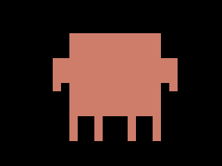
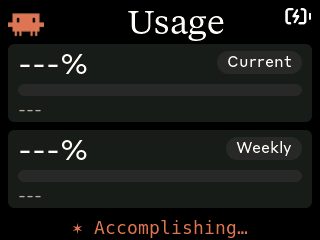
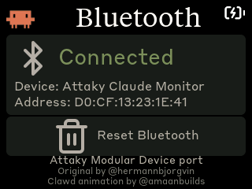
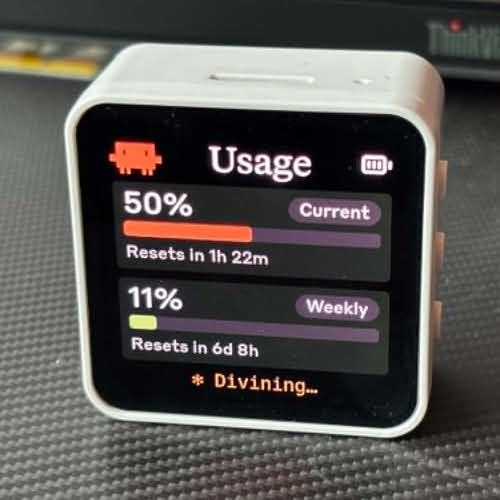

<div align="center">

  <a href="https://attaky.com">
    
  </a>

  <h2>Clawdmeter for the Attaky Modular Device</h2>

  <p>
    
    
    <a href="https://discord.attaky.com"></a>
  </p>

  <a href="https://attaky.com">Attaky home</a>
  &nbsp;·&nbsp;
  <a href="https://discord.attaky.com">Discord</a>

</div>

> This repository is a fork of [Clawdmeter](https://github.com/HermannBjorgvin/Clawdmeter),
> originally developed by [Hermann Björgvin Haraldsson](https://github.com/HermannBjorgvin),
> last modified by Attaky on **2026-07-10** from upstream **`bd2afb5`** (2026-05-11),
> to add support for the **Attaky Modular Device**. Upstream is intentionally
> unlicensed because of bundled copyrighted mascot assets — see the
> [licensing notes](#licensing-gray-area-warning) below.

A Claude Code usage dashboard for **Attaky Modular Device** hardware.
It pairs with your computer over Bluetooth; the splash screen plays
pixel-art Clawd animations that get busier as your usage rate climbs,
and the physical keys double as a BLE HID keyboard for Claude Code
shortcuts.

|              Splash               |              Usage              |                Bluetooth                |
| :-------------------------------: | :-----------------------------: | :-------------------------------------: |
|  |  |  |
|   Splash; touch-toggle anytime    | Session and weekly utilization  |    Connection status and bond reset     |

## Compatible devices

- **Attaky Core 1.0** — 320 × 240 landscape touchscreen, physical
  buttons, RGB indicator, and a motion sensor (present but unused by
  this firmware). Connects to the host over USB-C for flashing and
  serial.
- **Attaky Power_Standard-Cell_1.0** — Li-Po battery with on-board
  fuel gauge that reports battery percentage to the firmware.
- USB-C cable for flashing firmware and charging.

The hardware POWER button is a long-press power toggle handled at
the board level; firmware doesn't see it.

## What this fork adds on top of Clawdmeter

- **Attaky Core 1.0 build target** — 320 × 240 TFT + capacitive touch
  port of the original 480 × 480 AMOLED build, with regenerated fonts
  and icons for the smaller panel
- **D-pad + side keys as a BLE HID keyboard** — arrows, Enter,
  Shift+Tab and Space (Claude Code mode toggle / push-to-talk), read
  through the on-board I²C IO expander
- **Battery fuel-gauge support** — battery percentage from the Power
  cell module shown in the UI
- **macOS host support** — Python daemon, LaunchAgent and flash helper
  (originally ported by [Chris Davidson](https://github.com/lorddavidson))
  alongside the upstream Linux host
- **Freely licensed UI typefaces** — Source Serif 4 + Archivo (SIL OFL
  1.1) replace the proprietary brand fonts bundled upstream
- **BLE rename** — the device advertises as **"Attaky Claude Monitor"**

Upstream behavior (usage polling, BLE protocol, splash animation
logic) is unchanged.

## Build & flash

This is a fork — clone **this** repository (not the upstream
`HermannBjorgvin/Clawdmeter`) to get the Attaky Core build target:

```sh
git clone https://github.com/Attaky-Module/Clawdmeter.git
cd Clawdmeter
```

Prerequisites:

- Linux (tested on Ubuntu) or macOS
- [PlatformIO CLI](https://docs.platformio.org/en/latest/core/installation/index.html)
- A CH340 USB-serial driver (most current macOS/Linux ship one)
- Linux: `curl`, `bluetoothctl`, `busctl` (BlueZ Bluetooth stack)
- macOS: `python3` (the installer sets up a venv with `bleak` and `httpx`)
- Claude Code with an active subscription

Build with `pio run -d firmware`; flashing runs at 460800 baud (the
USB-serial bridge is not reliable at 921600). Full flash + pairing +
daemon setup is per-OS below.

## macOS installation

### Flash the firmware

The Core enumerates as `/dev/cu.usbserial-*` (not `/dev/cu.usbmodem*`):

```bash
./flash-mac.sh                          # auto-detects /dev/cu.usbserial-*
./flash-mac.sh /dev/cu.usbserial-2120   # or pass an explicit port
```

### Pair the device

After flashing, open **System Settings → Bluetooth** and click
*Connect* next to **"Attaky Claude Monitor"**. The daemon discovers it on
its next scan (~30 s).

If you ever tap **Reset Bluetooth** on the device, it drops its bond;
macOS will then refuse to reconnect with *"Peer removed pairing
information"*. That is expected — *Forget* "Attaky Claude Monitor" in
System Settings → Bluetooth, then connect again.

### Install the daemon

The daemon reads your Claude OAuth token from the macOS Keychain
(service `Claude Code-credentials`), polls usage every 60 s, and pushes
it to the display over BLE.

```bash
./install-mac.sh
```

The installer creates a Python venv in `daemon/.venv/`, installs
`bleak` and `httpx`, renders a LaunchAgent into
`~/Library/LaunchAgents/com.user.claude-usage-daemon.plist`, and loads
it. The first run is launched interactively so macOS prompts for
Bluetooth permission.

Useful commands:

```bash
launchctl list | grep claude-usage                                          # check it's running
tail -F ~/Library/Logs/claude-usage-daemon.out.log                          # live logs
launchctl unload ~/Library/LaunchAgents/com.user.claude-usage-daemon.plist  # stop
launchctl load -w ~/Library/LaunchAgents/com.user.claude-usage-daemon.plist # start
```

## Linux installation

### Flash the firmware

The Core enumerates as `/dev/ttyUSB0` (not `/dev/ttyACM0`):

```bash
./flash.sh                       # defaults to /dev/ttyUSB0
./flash.sh /dev/ttyUSB1          # or pass an explicit port
```

### Pair the device

After flashing, the device advertises as **"Attaky Claude Monitor"**. Pair
it once:

```bash
# Scan for the device
bluetoothctl scan le

# When "Attaky Claude Monitor" appears, pair and trust it
bluetoothctl pair AA:BB:CC:DD:EE:FF    # use your device's MAC
bluetoothctl trust AA:BB:CC:DD:EE:FF
```

The MAC address is shown on the Bluetooth screen — press the BOOT
button to cycle to it.

### Install the daemon

The daemon polls your Claude usage every 60 seconds and sends it to the
display over BLE.

```bash
./install.sh
systemctl --user start claude-usage-daemon
```

Check status: `systemctl --user status claude-usage-daemon`

View logs: `journalctl --user -u claude-usage-daemon -f`

## Screens

The device boots into the splash and stays there until you press the
**BOOT** button, which cycles between Usage and Bluetooth. Tap the
screen anywhere (except the Reset zone on the Bluetooth screen) to flip
back to the splash; tap again to dismiss it.

While the splash is up, the BOOT button cycles animations instead of
screens. The firmware also auto-rotates every 20 s within the current
usage-rate group, so a long stretch on the splash isn't just one Clawd
on loop.

## How it works

1. The daemon reads your Claude Code OAuth token (macOS Keychain, or
   `~/.claude/.credentials.json` on Linux).
2. It makes a minimal API call to `api.anthropic.com/v1/messages` — one
   token of Haiku, basically free.
3. The usage numbers come straight out of the response headers
   (`anthropic-ratelimit-unified-5h-utilization` and friends).
4. The daemon connects to the ESP32 over BLE and writes a JSON payload
   to the GATT RX characteristic.
5. The firmware parses it and updates the LVGL dashboard.
6. The firmware tracks the rate of change of session % over a 5-minute
   window and picks splash animations from the matching mood group.
7. The physical keys are independent of all of this — they emit BLE HID
   keyboard reports to the paired host directly (see below).

## Physical buttons

The keys send standard BLE HID keyboard reports, so they act on
whatever window has focus on the paired host — not just Claude Code.

| Key            | Function                                        |
| -------------- | ----------------------------------------------- |
| **D-pad ↑↓←→** | Arrow keys                                      |
| **SELECT**     | Enter / confirm                                 |
| **L1**         | Shift+Tab (Claude Code mode toggle)             |
| **R2**         | Space (Claude Code voice-mode push-to-talk)     |
| **BOOT**       | Cycle screens; on splash, cycle animations      |

The D-pad, SELECT, L1 and R2 keys are read through the on-board I²C IO
expander; BOOT is a dedicated GPIO. The hardware POWER button is a
power toggle handled below the firmware and is intentionally not
mapped.

## BLE protocol

The device advertises a custom GATT service alongside the standard HID
keyboard service:

|                            | UUID                                   |
| -------------------------- | -------------------------------------- |
| **Data Service**           | `4c41555a-4465-7669-6365-000000000001` |
| RX Characteristic (write)  | `4c41555a-4465-7669-6365-000000000002` |
| TX Characteristic (notify) | `4c41555a-4465-7669-6365-000000000003` |
| REQ Characteristic (notify)| `4c41555a-4465-7669-6365-000000000004` |
| **HID Service**            | `00001812-0000-1000-8000-00805f9b34fb` |

JSON payload format (written to RX):

```json
{ "s": 45, "sr": 120, "w": 28, "wr": 7200, "st": "allowed", "ok": true }
```

Fields: `s` = session %, `sr` = session reset (minutes), `w` = weekly %,
`wr` = weekly reset (minutes), `st` = status, `ok` = success flag.

## Recompiling fonts

The `firmware/src/font_*.c` files are pre-compiled LVGL bitmap fonts.
The 320×240 build uses the sizes already in the repo
(Serif 34; Sans 28/16/14/12; Mono 18). All three source typefaces are
freely licensed — Source Serif 4 (display serif) and Archivo (UI sans)
under the SIL OFL 1.1 (license texts in `assets/`), DejaVu Sans Mono
under the DejaVu/Bitstream Vera license. You only need this section if
you want to change the sizes.

```bash
npm install -g lv_font_conv
```

Generate each one (one at a time — `lv_font_conv` doesn't like
loop-driven invocations) with `--no-compress` (required for LVGL 9),
e.g.:

```bash
lv_font_conv --font assets/SourceSerif4-Regular.ttf -r 0x20-0x7E \
  --size 34 --format lvgl --bpp 4 --no-compress \
  -o firmware/src/font_serif_34.c --lv-include "lvgl.h"

for size in 28 16 14 12; do
  lv_font_conv --font assets/Archivo-Regular.ttf -r 0x20-0x7E \
    --size $size --format lvgl --bpp 4 --no-compress \
    -o firmware/src/font_sans_${size}.c --lv-include "lvgl.h"
done

lv_font_conv --font assets/DejaVuSansMono.ttf \
  -r 0x20-0x7E,0xB7,0x2026,0x2722,0x2733,0x2736,0x273B,0x273D \
  --size 18 --format lvgl --bpp 4 --no-compress \
  -o firmware/src/font_mono_18.c --lv-include "lvgl.h"
```

**Important:** `lv_font_conv` v1.5.3 outputs LVGL 8 format. Each
generated file must be patched for LVGL 9 compatibility:

1. Remove `#if LVGL_VERSION_MAJOR >= 8` guards around `font_dsc` and the font struct
2. Remove the `.cache` field from `font_dsc`
3. Add `.release_glyph = NULL`, `.kerning = 0`, `.static_bitmap = 0` to the font struct
4. Add `.fallback = NULL`, `.user_data = NULL` to the font struct

Without these patches, fonts compile but render as invisible.

## Converting icons

The UI uses a small set of [Lucide](https://lucide.dev) icons
(bluetooth + battery states) plus the logo, converted to RGB565 /
RGB565A8 C arrays for LVGL. The converter needs `pngjs`:

```bash
cd tools && npm install && cd ..
node tools/png_to_lvgl.js assets/icon_bluetooth_48.png icon_bluetooth_data ICON_BLUETOOTH_WIDTH ICON_BLUETOOTH_HEIGHT
```

Default tint is white (`0xFFFFFF`); Lucide PNGs ship as
black-on-transparent and would render invisible against the dark UI
without it. Pass `--no-tint` for pre-coloured artwork like the logo
(regenerated at 36×36 for the smaller screen). Battery icons use
RGB565A8 (alpha plane) so they blend cleanly over the splash; the rest
are baked RGB565 over the panel colour. Paste the converter output into
`firmware/src/icons.h` (or `logo.h` for the logo).

## Splash animations

The animations come from [claudepix.vercel.app](https://claudepix.vercel.app),
a library of Clawd sprites. `tools/scrape_claudepix.js` evaluates the
site's JavaScript in a Node VM to pull out frame data and palettes,
then `tools/convert_to_c.js` turns everything into RGB565 C arrays and
writes `firmware/src/splash_animations.h`.

To re-pull (e.g. when the source library updates):

```bash
node tools/scrape_claudepix.js
node tools/convert_to_c.js
pio run -d firmware -t upload
```

See `tools/README.md` for details.

## Credits

- Original Clawdmeter by @hermannbjorgvin.
- macOS host pieces (daemon, LaunchAgent, flash helper) by
  Chris Davidson (@lorddavidson).
- Attaky Core 1.0 hardware adaptation by the Attaky project.
- Pixel-art Clawd animation by @amaanbuilds. Frame data and palettes
  scraped + converted by the tooling in `tools/`.
- Lucide icon set (MIT) for the bluetooth and battery UI glyphs.
- UI typefaces: Source Serif 4 (Adobe, SIL OFL 1.1), Archivo
  (Omnibus-Type, SIL OFL 1.1) and DejaVu Sans Mono (Bitstream Vera
  license). OFL license texts ship in `assets/`.

## Licensing gray area warning

Unlike upstream, this fork does NOT bundle Anthropic's proprietary
brand fonts (Tiempos Text, Styrene B) — the UI was rebuilt on the
freely licensed typefaces listed above. The remaining gray area is the
Clawd mascot artwork. The original author's statement:

> The software in this repository uses and adheres to the Anthropic
> brand guidelines and uses the same proprietary fonts that Anthropic
> has a license for but this software uses without permission as well
> as using assets from Anthropic such as the copyrighted Clawd mascot
> so even though the code in this repo is non-proprietary I will not
> license it myself under a copyleft license since this repo includes
> proprietary fonts and copyrighted assets. Please be aware of this if
> you fork or copy the code from this repo. **You have been warned!**

For this fork the font half of that warning no longer applies; the
copyrighted Clawd mascot assets are still included as-is and are not
relicensed.

## Support

- **Attaky Modular Device / this fork** — Attaky [Discord](https://discord.attaky.com)
- **Clawdmeter concept / upstream firmware** — file at
  [`HermannBjorgvin/Clawdmeter`](https://github.com/HermannBjorgvin/Clawdmeter/issues)

---

# ↓ Upstream Clawdmeter README ↓

*Preserved from upstream `main` (`ca8a642`, 2026-07-09) for
attribution and reference. The hardware and install steps below
describe the upstream builds (Waveshare AMOLED and other community
boards), not the Attaky Core port above; some linked docs and media
files are not present in this fork.*

# Clawdmeter

A small ESP32 dashboard I made for my desk to keep an eye on Claude Code usage.

It runs on a [Waveshare ESP32-S3-Touch-AMOLED-2.16](https://www.waveshare.com/esp32-s3-touch-amoled-2.16.htm?&aff_id=149786) as well as a few other alternative boards and pairs over Bluetooth, the splash screen plays pixel-art Clawd animations that get
busier when your usage rate climbs. The two side buttons send Space and
Shift+Tab over BLE HID for Claude Code's voice mode and mode-toggle shortcuts.

|              Usage meter              |              Clawd animation screen              |
| :-----------------------------------: | :----------------------------------------------: |
|  |  |

The Clawd animations come from [claudepix](https://claudepix.vercel.app), [@amaanbuilds](https://x.com/amaanbuilds)'s library of pixel-art Clawd sprites, check it out, it's lovely.

## Screens

The device boots into the splash. Tap the screen anywhere to switch to the Usage view; tap again to flip back to the splash.

|              Splash               |              Usage              |
| :-------------------------------: | :-----------------------------: |
|  |  |
|   Splash; touch-toggle anytime    | Session and weekly utilization  |

While the splash is up, the middle (PWR) button cycles animations. **Hold the power button for 3 seconds, then release, to put the device into pairing mode** — this clears the saved Bluetooth bond and re-advertises. The firmware also auto-rotates animations every 20 s within the current usage-rate group, so a long stretch on the splash isn't just one Clawd on loop.

## Hardware

Boards supported out of the box:

- [Waveshare ESP32-S3-Touch-AMOLED-2.16](https://www.waveshare.com/esp32-s3-touch-amoled-2.16.htm?&aff_id=149786)
- [Waveshare ESP32-C6-Touch-AMOLED-2.16](https://www.waveshare.com/esp32-c6-touch-amoled-2.16.htm?&aff_id=149786) 
- [Waveshare ESP32-S3-Touch-AMOLED-1.8](https://www.waveshare.com/esp32-s3-touch-amoled-1.8.htm?&aff_id=149786)
- [Waveshare ESP32-C6-Touch-AMOLED-1.8](https://www.waveshare.com/esp32-c6-touch-amoled-1.8.htm?&aff_id=149786)

> Please check if a pull request exists for your alternative hardware port before opening a new one, providing QA feedback and testing on the same hardware is more valuable than duplicate pull requests.

**Porting to another board:** the firmware is a thin HAL with per-board folders under `firmware/src/boards/`. Drop in a new folder and a new PlatformIO env — `main.cpp`, `ui.cpp`, and `splash.cpp` never need to change. See [`docs/porting/adding-a-board.md`](docs/porting/adding-a-board.md) for the walk-through and [`docs/porting/hal-contract.md`](docs/porting/hal-contract.md) for the interfaces a port must implement.

## Prerequisites

- Linux (tested on Ubuntu), macOS, or Windows 10/11
- [PlatformIO CLI](https://docs.platformio.org/en/latest/core/installation/index.html)
- Linux: `curl`, `bluetoothctl`, `busctl` (BlueZ Bluetooth stack)
- macOS: `python3` (the installer sets up a venv with `bleak` and `httpx`)
- Windows: `python3` 3.11+ (the installer sets up a venv with `bleak`, `httpx`, and `pystray`)
- Claude Code with an active subscription

## macOS installation

The macOS host pieces — Python daemon, LaunchAgent, and flash helper — were ported by [Chris Davidson (@lorddavidson)](https://github.com/lorddavidson). Thanks Chris!

### Flash the firmware

```bash
./flash-mac.sh waveshare_amoled_216                       # auto-detects /dev/cu.usbmodem*
./flash-mac.sh waveshare_amoled_18  /dev/cu.usbmodem1101  # or pass an explicit USB serial port
```

The board env name is required. Run `./flash-mac.sh` with no args to see the available envs (scraped from `firmware/platformio.ini`).

### Pair the device

After flashing, open **System Settings → Bluetooth** and click *Connect* next to "Clawdmeter". The daemon only ever connects to the peripheral this Mac is paired/connected to — it never scans for a nearby device — so once it's connected here the daemon picks it up on its next poll (~60 s).

### Install the daemon

The daemon reads your Claude OAuth token from the macOS Keychain (service `Claude Code-credentials`), polls usage every 60 s, and pushes it to the display over BLE.

```bash
./install-mac.sh
```

The installer creates a Python venv in `daemon/.venv/`, installs `bleak` and `httpx`, renders a LaunchAgent into `~/Library/LaunchAgents/com.user.claude-usage-daemon.plist`, and loads it. The first run is launched interactively so macOS prompts for Bluetooth permission.

Useful commands:

```bash
launchctl list | grep claude-usage                                          # check it's running
tail -F ~/Library/Logs/claude-usage-daemon.out.log                          # live logs
launchctl unload ~/Library/LaunchAgents/com.user.claude-usage-daemon.plist  # stop
launchctl load -w ~/Library/LaunchAgents/com.user.claude-usage-daemon.plist # start
```

## Linux installation

### Flash the firmware

```bash
./flash.sh waveshare_amoled_216                  # defaults to /dev/ttyACM0
./flash.sh waveshare_amoled_18  /dev/ttyACM1     # or pass an explicit USB serial port
```

The board env name is required. Run `./flash.sh` with no args to see the available envs (scraped from `firmware/platformio.ini`).

### Pair the device

After flashing, the device advertises as "Clawdmeter". Pair it once:

```bash
# Scan for the device
bluetoothctl scan le

# When "Clawdmeter" appears, pair and trust it
bluetoothctl pair F4:12:FA:C0:8F:E5    # use your device's MAC
bluetoothctl trust F4:12:FA:C0:8F:E5
```

To re-pair later, hold the power button for 3 seconds then release — the device clears its saved bond and re-advertises.

### Install the daemon

The daemon polls your Claude usage every 60 seconds and sends it to the display over BLE.

```bash
./install.sh
systemctl --user start claude-usage-daemon
```

Check status: `systemctl --user status claude-usage-daemon`

View logs: `journalctl --user -u claude-usage-daemon -f`

## Windows installation

Runs natively on Windows — no WSL required. A system-tray app polls your usage and pushes it over BLE, and starts automatically at login.

### Prerequisites

- **Native Windows** (not WSL).
- **Python 3.11+** from [python.org](https://www.python.org/downloads/) — check *"Add python.exe to PATH"* during install.
- **Claude Code** installed, with `claude login` completed. The token is read from `%USERPROFILE%\.claude\.credentials.json` (falling back to `%LOCALAPPDATA%\Claude\` then `%APPDATA%\Claude\`).
- The repo on a **native Windows path** (e.g. `%USERPROFILE%\Clawdmeter`), **not** a `\\wsl$` share — the installer refuses a WSL path.

### Flash the firmware

```powershell
pio run -d firmware -e waveshare_amoled_216 -t upload --upload-port COM5   # use your device's COM port
```

Run `pio run -d firmware` with no env to see the available board envs.

### Pair the device

The device is a bonded BLE HID keyboard, so pair it once: **Settings → Bluetooth & devices → Add device → Bluetooth**, then select "Clawdmeter". Pairing is **required** — it enables the physical buttons and keeps a persistent connection (the device keeps showing your last-synced usage even after the daemon quits). To undo, use **Remove device** (this disables the buttons).

### Install the daemon (recommended)

From the repo root in PowerShell:

```powershell
powershell -ExecutionPolicy Bypass -File install-windows.ps1
```

This creates a venv, installs `bleak`/`httpx`/`pystray`/`Pillow` from the in-repo requirements (no internet downloads), registers a per-user login-autostart entry (`HKCU\…\Run`, no admin needed), and launches the tray app headlessly (no console window).

### Run manually instead (optional)

```powershell
python -m venv .venv
.venv\Scripts\Activate.ps1        # if blocked: Set-ExecutionPolicy -Scope CurrentUser RemoteSigned, then retry
pip install -r daemon\requirements-windows.txt
python daemon\claude_usage_daemon_windows.py        # runs in the foreground; Ctrl+C to stop
```

### Tray icon and menu

The icon's corner bubble shows state — **green** Connected, **amber** Scanning, **red** Error — and hovering shows the status (`Connected · last update HH:MM`). A notification fires once when it enters Error (e.g. an expired token). Right-click for the menu:

- **Status header** — live state + last sync time.
- **Start at login** — toggle autostart on/off.
- **Quit** — stops the daemon cleanly; leaves the Windows pairing intact (device keeps its last reading).

### Logs and troubleshooting

```powershell
Get-Content $env:LOCALAPPDATA\Clawdmeter\daemon.log -Tail 30        # view logs
reg delete "HKCU\Software\Microsoft\Windows\CurrentVersion\Run" /v Clawdmeter /f   # remove autostart
```

| Symptom | Fix |
|---------|-----|
| `Device not found` | Power on the device; make sure it's in range and paired. |
| `token expired` toast / `API HTTP 401` | Re-run `claude login`, then restart the daemon. |
| `Connection failed` | Toggle Windows Bluetooth off/on in Settings. |
| `Warning: running under Linux/WSL` | Run from a native PowerShell window, not a WSL shell. |

## How it works

1. The daemon reads your Claude Code OAuth token — from the macOS Keychain (service `Claude Code-credentials`) on macOS, or from `~/.claude/.credentials.json` on Linux (`%USERPROFILE%\.claude\.credentials.json` on Windows).
2. It makes a minimal API call to `api.anthropic.com/v1/messages` — one token of Haiku, basically free.
3. The usage numbers come straight out of the response headers (`anthropic-ratelimit-unified-5h-utilization` and friends).
4. The daemon connects to the ESP32 over BLE and writes a JSON payload to the GATT RX characteristic.
5. The firmware parses it and updates the LVGL dashboard.
6. The firmware also tracks the rate of change of session % over a 5-minute window and picks splash animations from the matching mood group.
7. The two side buttons are independent of all of this — they send Space and Shift+Tab as BLE HID keyboard input to the paired host directly.

## Physical buttons

The board has three side buttons. Left and right send HID keys; the middle (PWR) button cycles splash animations and, held for 3 seconds, triggers pairing mode.

| Button           | GPIO         | Function                                                       |
| ---------------- | ------------ | -------------------------------------------------------------- |
| **Left**         | GPIO 0       | Hold to send Space (Claude Code voice-mode push-to-talk)       |
| **Middle** (PWR) | AXP2101 PKEY | On splash: cycle animations. Hold 3s + release: pairing mode |
| **Right**        | GPIO 18      | Press to send Shift+Tab (Claude Code mode toggle)              |

Space and Shift+Tab go out as standard BLE HID keyboard reports, so they trigger in whatever window has focus on the paired host — not just Claude Code.

## BLE protocol

The device advertises a custom GATT service alongside the standard HID keyboard service:

|                            | UUID                                   |
| -------------------------- | -------------------------------------- |
| **Data Service**           | `4c41555a-4465-7669-6365-000000000001` |
| RX Characteristic (write)  | `4c41555a-4465-7669-6365-000000000002` |
| TX Characteristic (notify) | `4c41555a-4465-7669-6365-000000000003` |
| **HID Service**            | `00001812-0000-1000-8000-00805f9b34fb` |

JSON payload format (written to RX):

```json
{ "s": 45, "sr": 120, "w": 28, "wr": 7200, "st": "allowed", "ok": true }
```

Fields: `s` = session %, `sr` = session reset (minutes), `w` = weekly %, `wr` = weekly reset (minutes), `st` = status, `ok` = success flag.

## Recompiling fonts

The `firmware/src/font_*.c` files are pre-compiled LVGL bitmap fonts.

```bash
npm install -g lv_font_conv
```

Generate each one (one at a time — `lv_font_conv` doesn't like loop-driven invocations) with `--no-compress` (required for LVGL 9):

```bash
# Tiempos Text (titles, 56px)
lv_font_conv --font assets/TiemposText-400-Regular.otf -r 0x20-0x7E \
  --size 56 --format lvgl --bpp 4 --no-compress \
  -o firmware/src/font_tiempos_56.c --lv-include "lvgl.h"

# Styrene B (large numbers 48, panel labels 28, small text 24, minimal 20)
for size in 48 28 24 20; do
  lv_font_conv --font assets/StyreneB-Regular.otf -r 0x20-0x7E \
    --size $size --format lvgl --bpp 4 --no-compress \
    -o firmware/src/font_styrene_${size}.c --lv-include "lvgl.h"
done

# DejaVu Sans Mono (32px, with spinner Unicode chars)
lv_font_conv --font assets/DejaVuSansMono.ttf \
  -r 0x20-0x7E,0xB7,0x2026,0x2722,0x2733,0x2736,0x273B,0x273D \
  --size 32 --format lvgl --bpp 4 --no-compress \
  -o firmware/src/font_mono_32.c --lv-include "lvgl.h"
```

**Important:** `lv_font_conv` v1.5.3 outputs LVGL 8 format. Each generated file must be patched for LVGL 9 compatibility:

1. Remove `#if LVGL_VERSION_MAJOR >= 8` guards around `font_dsc` and the font struct
2. Remove the `.cache` field from `font_dsc`
3. Add `.release_glyph = NULL`, `.kerning = 0`, `.static_bitmap = 0` to the font struct
4. Add `.fallback = NULL`, `.user_data = NULL` to the font struct

Without these patches, fonts compile but render as invisible.

## Converting Lucide icons

The UI uses a small set of [Lucide](https://lucide.dev) icons (bluetooth + battery states) converted to RGB565 / RGB565A8 C arrays for LVGL.

```bash
node tools/png_to_lvgl.js assets/icon_bluetooth_48.png icon_bluetooth_data ICON_BLUETOOTH_WIDTH ICON_BLUETOOTH_HEIGHT
```

Default tint is white (`0xFFFFFF`); Lucide PNGs ship as black-on-transparent and would render invisible against the dark UI without it. Pass `--no-tint` for pre-coloured artwork like the logo. Battery icons use RGB565A8 (alpha plane) so they blend cleanly over the splash; the rest are baked RGB565 over the panel colour. Paste the converter output into `firmware/src/icons.h`.

## Splash animations

The animations come from [claudepix.vercel.app](https://claudepix.vercel.app),
a library of Clawd sprites. `tools/scrape_claudepix.js` evaluates the
site's JavaScript in a Node VM to pull out frame data and palettes, then
`tools/convert_to_c.js` turns everything into RGB565 C arrays and writes
`firmware/src/splash_animations.h`.

To re-pull (e.g. when the source library updates):

```bash
node tools/scrape_claudepix.js
node tools/convert_to_c.js
pio run -d firmware -t upload
```

See `tools/README.md` for details.

## Credits

- Pixel-art Clawd animation by [@amaanbuilds](https://x.com/amaanbuilds), sourced from [claudepix.vercel.app](https://claudepix.vercel.app). Frame data and palettes scraped + converted by the tooling in `tools/`.
- Lucide icon set ([lucide.dev](https://lucide.dev), MIT) for bluetooth and battery UI glyphs.
- Anthropic brand fonts (Tiempos Text, Styrene B) — see licensing warning below.

## Licensing gray area warning

The software in this repository uses and adheres to the Anthropic brand guidelines and uses the same proprietary fonts that Anthropic has a license for but this software uses without permission as well as using assets from Anthropic such as the copyrighted Clawd mascot so even though the code in this repo is non-proprietary I will not license it myself under a copyleft license since this repo includes proprietary fonts and copyrighted assets. Please be aware of this if you fork or copy the code from this repo. **You have been warned!**
